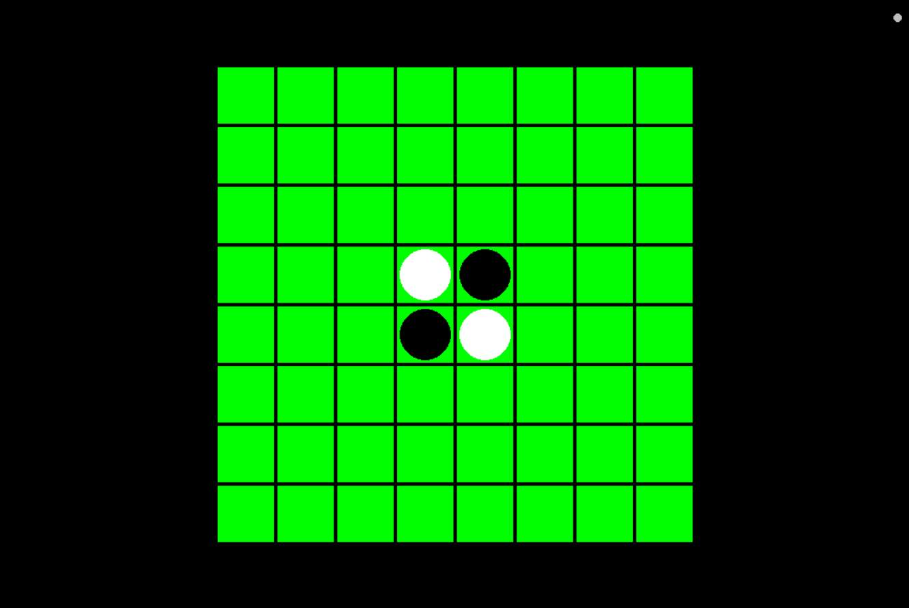
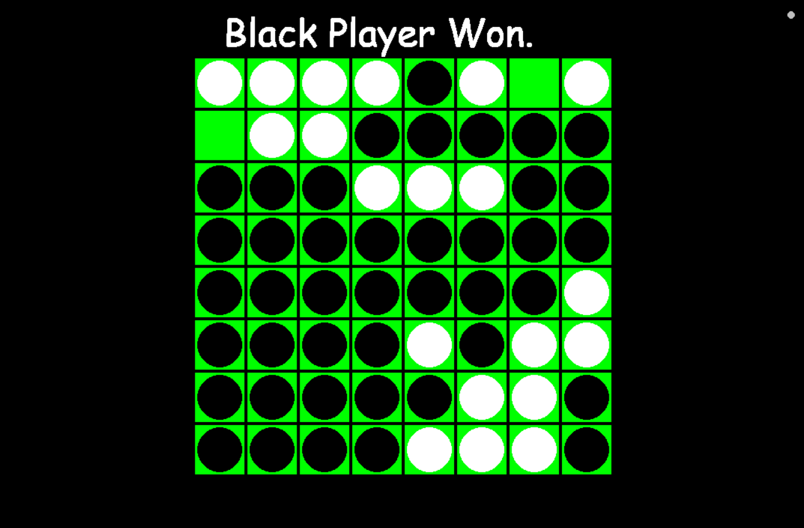

# Othello / Reversi with AI (Minimax)

🎮 A Python implementation of the classic **Othello (Reversi)** board game with:
- A **pygame-based GUI**
- An **AI opponent** powered by the Minimax algorithm
- Both `.bat` and `.exe` launchers for quick startup

---

## ✨ Features
- 8×8 board rendered with **pygame**
- **Human vs AI** gameplay
- AI uses **Minimax with configurable depth**
- Automatic detection of **valid moves**
- **Game over detection** with final score
- Works on **Windows** with:
  - `main.py` (for Python users)
  - `run.bat` (double-click batch script)
  - `Othello.exe` (packaged executable, no Python required)

---

## 🖼️ Screenshots

### Game Start


### Game Over


---

## 🚀 Getting Started

### 1. Run with Python (developers)
Make sure you have **Python 3.10+** and install dependencies:

```bash
pip install pygame
````

Then run:

```bash
python main.py
```

---

### 2. Run with `.bat` (Windows, Python required)

Double-click:

```
run.bat
```

This will simply call:

```bat
python main.py
```

---

### 3. Run with `.exe` (Windows, no Python required)

If you don’t have Python installed, just double-click:

```
Othello.exe
```

---

## 🧠 How the Game Works

* You play as **White** by clicking on valid cells.
* The **AI (Black)** responds automatically after your move.
* The game ends when:

  * No valid moves remain for either player, **or**
  * One player has no discs left.

The winner is shown at the end.

---

## 📂 Project Structure

```
MiniMax/
│── main.py                 # Entry point
│── run.bat                 # Run game via Python
│── Othello.exe             # Standalone executable
│── artificialIntelligence.py
│── boardManagement.py
│── gameEvaluator.py
│
└── core/
    │── gui.py              # Pygame GUI
```

---

## 🛠️ Development Notes

* The AI depth can be tuned in `gui.py`:

  ```python
  self.ai = ArtificialIntelligence(evaluator=self.evaluator, depth=5)
  ```
* Higher depth → smarter AI but slower moves.

---

## 📦 Build Your Own EXE

If you want to rebuild `Othello.exe`, install [PyInstaller](https://www.pyinstaller.org/):

```bash
pip install pyinstaller
pyinstaller --onefile --windowed main.py
```

Your executable will be in `dist/main.exe`.

---

## 📜 License

This project is released under the MIT License – feel free to use, modify, and share.

---

👨‍💻 **Author**: Your Name Here

```

---

👉 Do you want me to also add a **short "How to Play Othello" section** in the README (rules for new users), or keep it purely technical?
```
